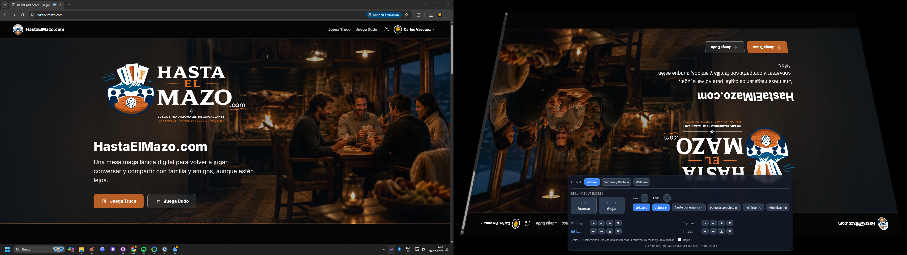
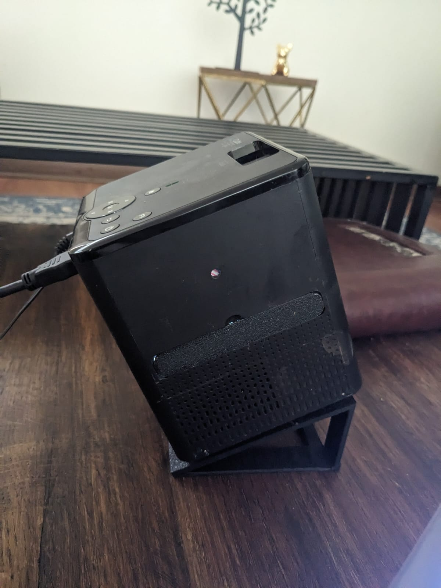
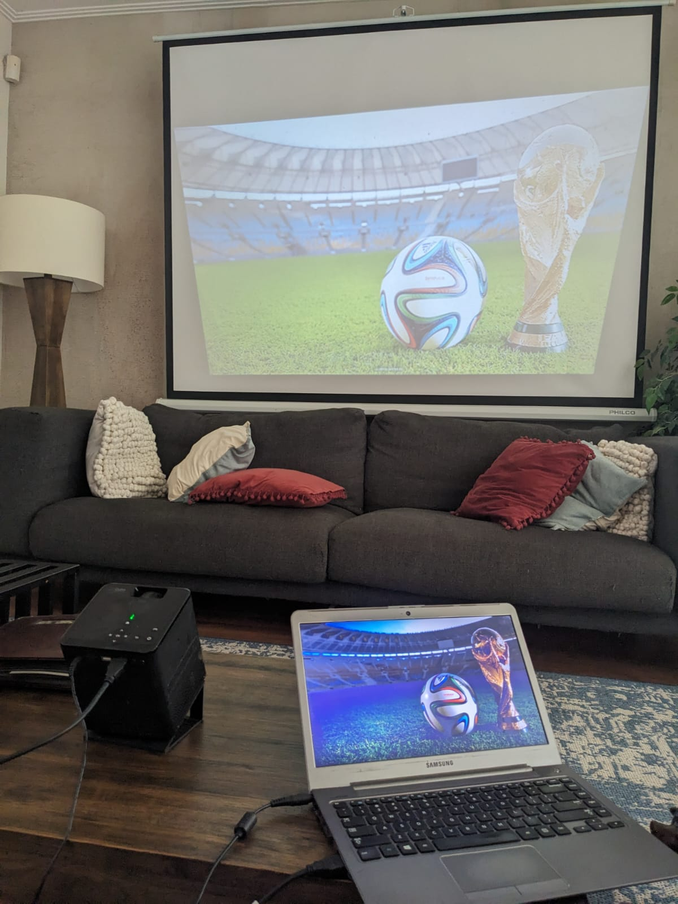
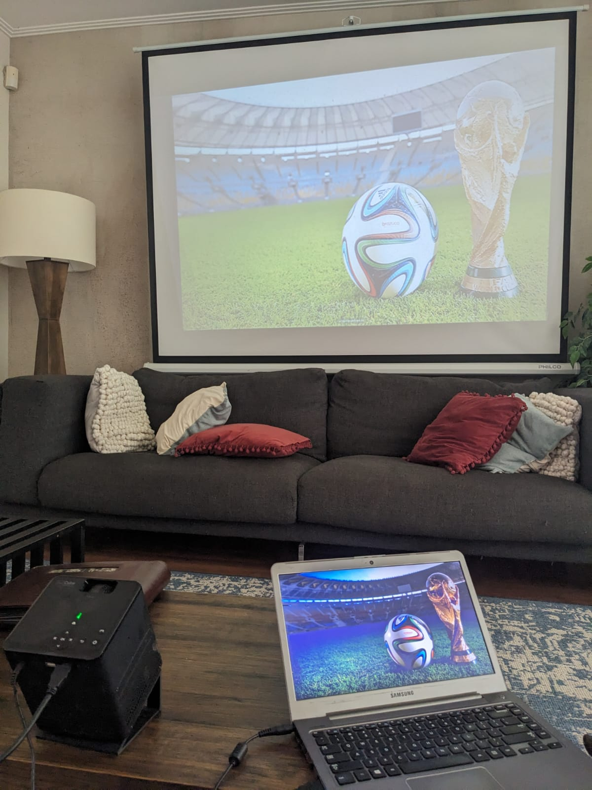

# Trapecio Keystone – Proyector

Extensión de Google Chrome que **captura una pestaña (o ventana/pantalla) y la
proyecta a pantalla completa en un lienzo WebGL con forma de trapecio**, para
**corregir el keystone por software** en proyectores que no traen ajuste de
keystone propio. Así puedes usar cualquier página web y que se vea recta.

La captura se dibuja en un canvas WebGL con un mapeo de textura
*perspective-correct*: al mover las esquinas superiores, la imagen se deforma
como un rectángulo proyectado (no una simple deformación lineal), que es
justamente lo que compensa la inclinación del proyector.



*Entrada y salida lado a lado: a la izquierda, la pestaña original tal cual la
ves en Chrome; a la derecha, la **ventana proyector** con esa misma página
deformada como trapecio (aquí además volteada para montaje en techo) junto al
panel de control de la extensión.*

## En acción con un proyector real

Un proyector económico sin ajuste de keystone propio, apoyado **inclinado** sobre
un soporte para apuntar a la pantalla:

<p align="center">
  
</p>

Al estar inclinado, la imagen llega **deformada como trapecio**. Con la extensión
corriges el keystone por software hasta que se ve recta:

| Sin corrección | Con la extensión |
|:---:|:---:|
|  |  |
| El proyector inclinado produce un trapecio: los bordes quedan torcidos y la imagen no llena la pantalla. | La corrección de keystone endereza la imagen para que ocupe la pantalla como un rectángulo. |

## Características

- **Tres fuentes de video** seleccionables (en la pantalla inicial o en el
  control «Fuente» del panel):
  1. **Pestaña** de Chrome con un solo clic (`chrome.tabCapture`).
  2. **Otra ventana o pantalla** (`chrome.desktopCapture`).
  3. **Webcam / entrada de video** (`getUserMedia`), con selector de cámara si
     tienes varias.
- Abre la proyección en el **segundo monitor** (el proyector) y en **pantalla
  completa** automáticamente cuando hay dos pantallas.
- **Voltear vertical / horizontal** (útil para montaje en techo o
  retroproyección).
- **Acercar / Alejar** para juntar o separar las esquinas **superiores** e
  **inferiores** del trapecio de forma muy simple. «Alejar» puede sobrepasar los
  bordes de la pantalla para agrandar la imagen.
- **Zoom (Agrandar / Achicar)** para escalar toda la imagen proyectada.
- **Tamaño (Ancho / Alto)** para estirar o encoger la imagen en cada eje de forma
  independiente (útil si el proyector la deja demasiado ancha o demasiado alta),
  con dos ajustes automáticos: **Rellenar** (cubre todo el ancho y alto,
  estirando sin respetar la proporción) y **Uniforme** (ocupa el máximo posible
  manteniendo la proporción original de la fuente).
- **Inclinación izquierda / derecha** para rotar el lienzo y compensar un
  proyector que quedó torcido.
- **Mover el canvas** (arriba, abajo, izquierda y derecha) para reposicionar la
  imagen dentro de la pantalla, con un botón central para centrarla de nuevo.
- Ajuste avanzado de las **4 esquinas** (X e Y) para corrección de keystone de 4
  puntos.
- Rejilla de alineación opcional.
- La **última configuración usada** —esquinas, tamaño (ancho/alto), zoom,
  inclinación, posición, paso y volteos— se guarda sola y se vuelve a cargar
  automáticamente al abrir el proyector.
- **Guardar / Cargar un «Default»**: guarda tu calibración preferida en una ranura
  aparte y restáurala cuando quieras con un clic (distinto de «Reiniciar», que
  vuelve al rectángulo de fábrica).

## Instalación (modo desarrollador)

1. Descarga o clona esta carpeta.
2. Abre `chrome://extensions` en Chrome.
3. Activa el **Modo de desarrollador** (arriba a la derecha).
4. Haz clic en **Cargar descomprimida** y selecciona la carpeta del proyecto
   (la que contiene `manifest.json`).
5. Aparecerá el icono del trapecio en la barra de extensiones.

## Uso

1. Abre la pestaña con la web que quieres proyectar.
2. Haz clic en el icono de la extensión.
   - Se genera la captura de esa pestaña y se abre la **ventana proyector**.
   - Si tienes un segundo monitor, la ventana se coloca allí en pantalla
     completa. Si no, arrastra la ventana al proyector y pulsa **F**.
3. Usa los botones **Acercar / Alejar** de las esquinas **superiores** e
   **inferiores** para ajustar el trapecio hasta que la imagen se vea recta:
   - **Acercar**: junta esas dos esquinas (ese borde queda más angosto).
   - **Alejar**: las separa (puede sobrepasar la pantalla para agrandar).
4. Para un ajuste fino de una esquina concreta, abre **«Ajuste por esquina»** y
   mueve cada una de forma independiente.

Para **cambiar de fuente** en cualquier momento, usa la fila **«Fuente»** del
panel: *Pestaña*, *Ventana / Pantalla* o *Webcam*. Con webcam aparece un
desplegable **«Cámara»** para elegir el dispositivo (la primera vez Chrome pide
permiso de cámara).

> Nota: si la pestaña es una página interna de Chrome (`chrome://`, la Web
> Store, etc.) no se puede capturar. En ese caso usa **«Ventana / Pantalla»** o
> **«Webcam»**.

## Atajos de teclado (en la ventana proyector)

| Tecla        | Acción                                                        |
|--------------|---------------------------------------------------------------|
| `←` / `→`    | Sin esquina seleccionada: Acercar / Alejar el borde superior  |
| `1` `2` `3` `4` | Seleccionar esquina (SupIzq, SupDer, InfIzq, InfDer)       |
| `←` `→` `↑` `↓` | Mover la esquina seleccionada                              |
| `+` / `-`    | Aumentar / reducir el tamaño del paso                         |
| `RePág` / `AvPág` | Zoom: agrandar / achicar la imagen                       |
| `,` / `.`    | Inclinar (rotar) el lienzo a la izquierda / derecha           |
| `W` `A` `S` `D` | Mover el canvas (arriba / izquierda / abajo / derecha)     |
| `V`          | Voltear verticalmente                                         |
| `B`          | Voltear horizontalmente                                       |
| `F`          | Pantalla completa                                             |
| `G`          | Mostrar / ocultar rejilla de alineación                       |
| `H`          | Ciclar el panel: completo → mini (botón) → oculto             |
| `R`          | Reiniciar la calibración (esquinas, zoom, tamaño, inclinación y posición) |

## Cómo funciona la corrección

Las 4 esquinas del cuadrilátero viven en coordenadas NDC y pueden **sobrepasar
los bordes de la pantalla** (más allá de `-1..1`) para agrandar la imagen si hace
falta. Tanto el borde superior como el inferior se estrechan o ensanchan con sus
propios botones de Acercar / Alejar.

Para que la textura no se deforme de manera afín (incorrecta), se calcula la
coordenada homogénea `q` de cada vértice a partir de la intersección de las
diagonales del cuadrilátero. La textura se pasa como `(u·q, v·q, q)` y el
fragment shader hace `texture2D(tex, uv.xy / uv.z)`, logrando un mapeo
*perspective-correct*. Un trapecio muestra entonces la imagen como el
rectángulo proyectado que compensa el keystone del proyector.

## Estructura

```
manifest.json        Manifest V3 de la extensión
background.js         Service worker: captura la pestaña y abre el proyector
viewer.html/css/js    Ventana proyector: WebGL + controles del trapecio
icons/                Iconos generados
images/               Capturas usadas en este README
tools/generate_icons.py  Generador de iconos (solo stdlib de Python)
```

## Permisos

- `tabCapture` — capturar la pestaña activa.
- `desktopCapture` — capturar otra ventana/pantalla (opcional, bajo demanda).
- `system.display` — detectar el segundo monitor para colocar la proyección.
- `activeTab` — acceso a la pestaña activa al invocar la extensión.

No se envía nada a ningún servidor: todo el procesamiento es local en tu equipo.

## Autor

Desarrollado por **Carlos Vasquez** — <https://github.com/cvasquez-github/chrome-trapezoid-extenson>
